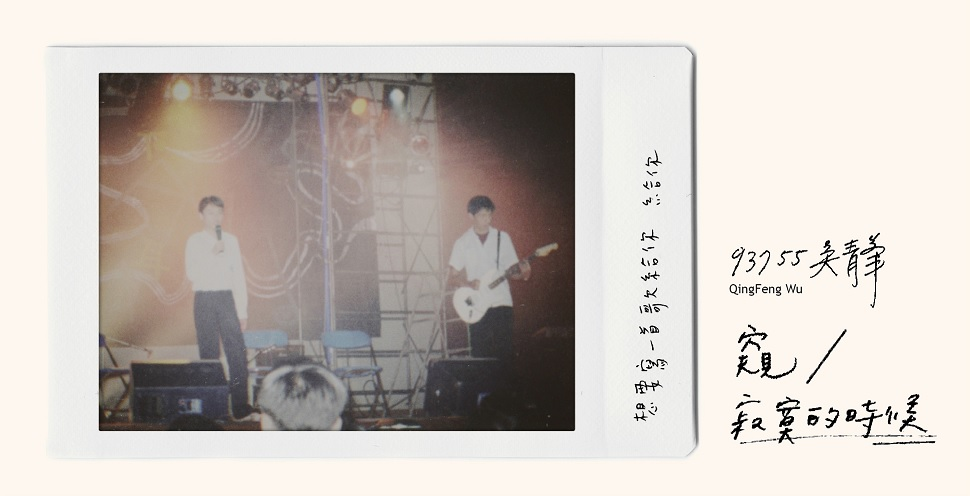

::: tip 发行信息

发行时间： **2019-12-06**

发行公司： **哈里坤的狂歡有限公司 The Harlequin''s Carnival Ltd.**

:::

## 介绍

20年前的首次创作 成就20年后的疯子自传

吴青峰《窥／寂寞的时候》

复刻日盘8cm单曲

12月6日 珍藏发行

实体单曲限定：吴青峰高中创作手稿、一封信：给2000年的青峰

封面照片：王希文 & 吴青峰 2000年〈窥〉首次演出 @ 附中天韵奖

“感谢那时候写歌的自己，如果不是那时候的自己，不知道自己会写歌，不知道自己能唱歌，以后也不能够碰到你们。”－吴青峰，2019年11月，高雄巨蛋。

楔子

在平行的时空里

2000年的吴青峰，正在创作一首光怪陆离

那是他的第一首创作

怎样也想不到，20年后的吴青峰，会唱出那些深刻必须

就像张透著光的即可拍，梦境一般，不变的是那份对音乐的爱

整理了20年间的创作，青峰找到第一、二首创作手稿〈窥〉、〈寂寞的时候〉

每个喜欢音乐的片刻，那些热情，又那样的清晰

这是他，在人生这一刻，最想唱的歌曲

〈窥 （20周年版）〉

底片就绪

时间：2000年

地点：附中高三教室外的石阶

人物：937班55号 吴青峯

高一时，参加过天韵奖的自弹自唱组，高三了，这是天韵奖第一次举办创作组。完全不会创作的吴青峰，羞涩、蓄著被同学取笑的瓜皮发型，在放学路上乱哼唱着，其实他根本不懂怎么创作，只是壮了个胆，想说，反正都已经高三了，硬著头皮报名创作组，在回家的路上哼著；到家后，思考词曲的排序；隔天下课，坐在教室外的石阶上，写完他第一首创作，〈窥〉。可能因为初生之犊不畏虎，93755吴青峯，就这样抓着班上弹吉他的93746王希文替他伴奏，一起登上了附中天韵奖的舞台，也就得了名。

时光跳转，20年后，吴青峰成为了流行乐坛不可多得的桂冠诗人，王希文也成为电影配乐与音乐剧重要制作翘楚，在各大音乐奖项都能见到他俩的身影。整理自己的创作年谱，青峰意外发现高中时的手稿，也找到〈窥〉首演诞生的照片，惊喜之余，决定将最初的创作发行问世，与大家见面。找回同班同学王希文，一起重温20年前做音乐的纯粹美好。〈窥：20周年版〉，就像是个“20年后还是继续任性做音乐的版本”，带着点蓝调与大乐队的任性小摇摆，轻快感十足，透过当时的青春音符及词句，让20年后的自己，刻划出关于青春的活泼彩色，就像词里唱的：“反正这世界本来就没道理”，那就让我们继续没道理的对音乐爱下去！

〈寂寞的时候〉

快门，按下

时间：2000年 / 2019年互相交错

地点：房间内 / 演唱会上

人物：吴青峰（吾轻疯？）

动作：手拿录音机，录下自己的清唱

“今天开场演唱的〈寂寞的时候〉，是我人生创作的第二首歌，大家应该都没有听过，那是自己在大学时期手工一张一张制作的单曲。”20年后的演唱会，青峰开场唱了人生创作的第二首歌曲，珍惜那些纯粹时光，20年前在房间里为自己哼唱的青峰，如今对大家唱着。大学时，自己手做限量200套单曲，用画笔为每份包装涂上色彩。那时的他，文字还在萌芽，音乐就是画布，一笔一划，就这么描绘出他的音乐人生。这次单曲内，〈寂寞的时候〉开头，想重现当时一个人唱歌的情境，整首歌曲的每个音，都像在提醒著，“没有当时写歌的自己，就没有现在的自己。”

---

- [微博小作文](https://weibo.com/1822796164/IiTBT54M1)

## 曲目

### 01 窥 (20周年版)

[窥 (20周年版)](https://weibo.com/1822796164/Ik6Dv1CjS)

作词 : 吴青峰  
作曲 : 吴青峰  

我看着你的表情就快成雨季  
拿出了纸和铅笔也无法算计  
把太阳一口吹熄找不到逻辑  
反正这世界本来就没道理  

你皱纹让我质疑像预报天气  
在你指缝间我继续游戏  
忍不住超速看不太清晰  
我放弃谦虚无所谓收集  

也许我脸孔全都荒废  
猜忌你想起忘记谁  
可能廉价的没有滋味  
欺骗了谁与你相随  
不介意再设下一回  
轻易就剥离了安慰  

放一颗星球 在你的眉头  
等你开口 再长出宇宙  
要我伸出手 在你的背后  
让你挥霍 哪一只脆弱

::: details 制作信息

詞曲／吳青峰  
製作、編曲／王希文  
導演／8ID STUDIO  
 
配唱／王希文  
人聲剪輯／許哲珮  
製作助理／朱彩蓁  
混音／錢煒安  
母帶／黃文萱 ＠ Purring Sound Studio  
 
鋼琴／王希文  
電吉他／徐平  
貝斯／甯子達  
爵士鼓／黃子瑜   
 
人聲、貝斯、爵士鼓錄音師／錢煒安  
人聲、貝斯、爵士鼓錄音助理／陳祺龍  
錄音室／112F Recording Studio  
 
弦樂演奏／耀爆甘音樂工作室  
第一小提琴／ 蔡曜宇 、朱奕寧、駱思云、林崇倫  
第二小提琴／ 盧思蒨 、黃雨柔  、曲靜家  
中提琴／甘威鵬、牟啟東  、凃瓔真  
弦樂錄音師／楊敏奇  
錄音助理／徐振程  
錄音室／玉成戲院錄音室  
 
管樂演奏／  
小號／黃線  
中音薩克斯風／潘子爵  
次中音薩克斯風／魯湘永  
上低音薩克斯風／林昱廷  
長號／鄧世偉  
 
管樂錄音師／林尚伯 ＠ 杰林藝術製作   
錄音室／佳聲錄音室

:::

### 02 寂寞的时候

[寂寞的时候](https://weibo.com/1822796164/IlCUtdU2c)

作词 : 吴青峰  
作曲 : 吴青峰  

寂寞的时候会想要写一首歌给你  
想你现在会不会也有一点孤寂  
雨滴是否淹没你眼睛 像海洋离开了鱼  
寂寞的时候会想要写一首歌给你倾听  

寂寞的时候会想打一通电话给你  
告诉你无可救药的固执不是故意  
落叶压坏我的情绪 蓝天也生云的气  
寂寞的时候会想打一通电话给你叹息  

&emsp;&emsp;而你是否在意 两颊风干的痕迹  
&emsp;&emsp;而你是否会关心 双手冰冷的无力  

寂寞的时候会想要写一首歌给你  
寂寞的时候会想要写一首歌给你 给你  

想问问你现在人在哪里

::: details 制作信息

詞曲／吳青峰  
導演／8ID STUDIO  
 
製作人／吳青峰、徐千秀  
編曲／鐘承洋  
吉他／鐘承洋  
錄音（吉他）／鐘承洋  
錄音（人聲）／吳青峰@青Home  
混音、母帶／黃文萱 Ziya Huang@Purring Sound Studio  
製作助理／張育維

:::